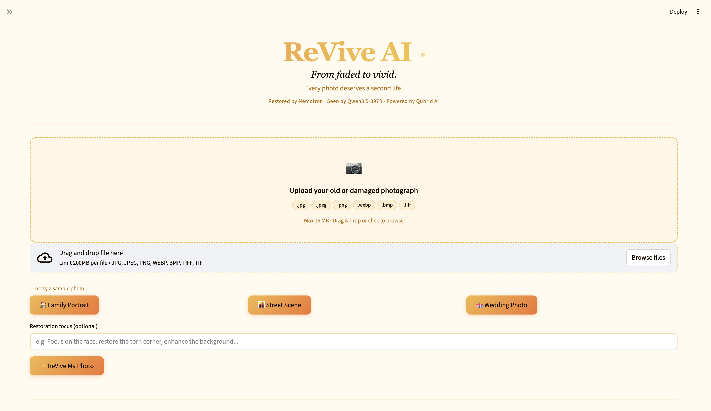
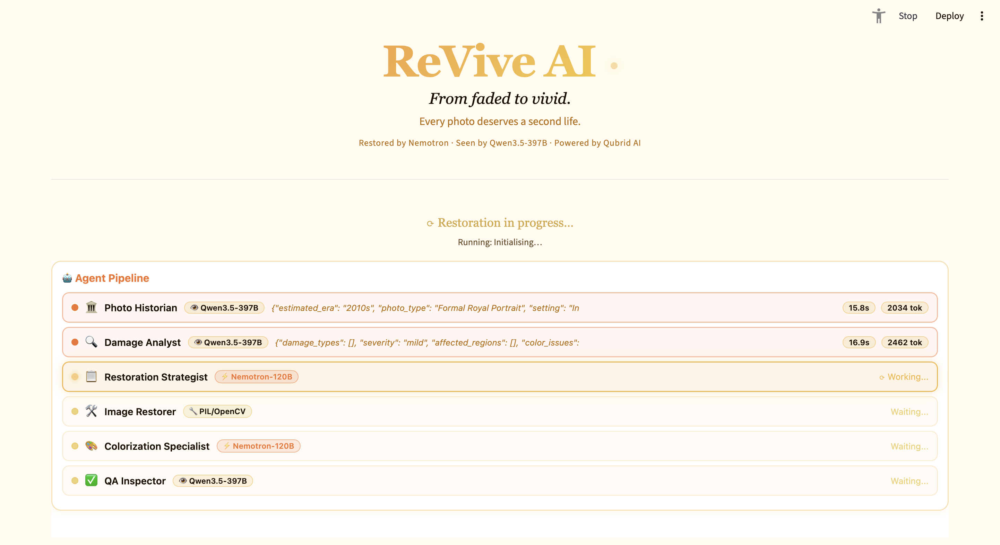
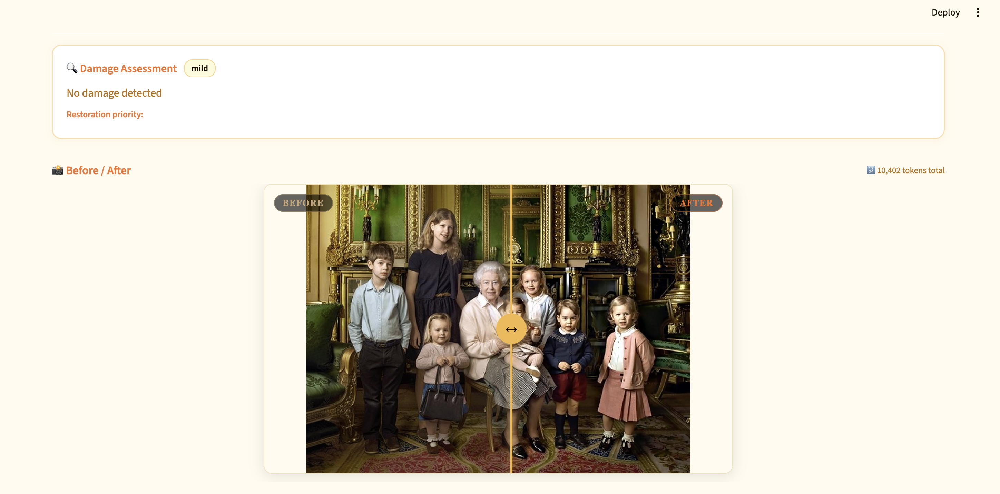
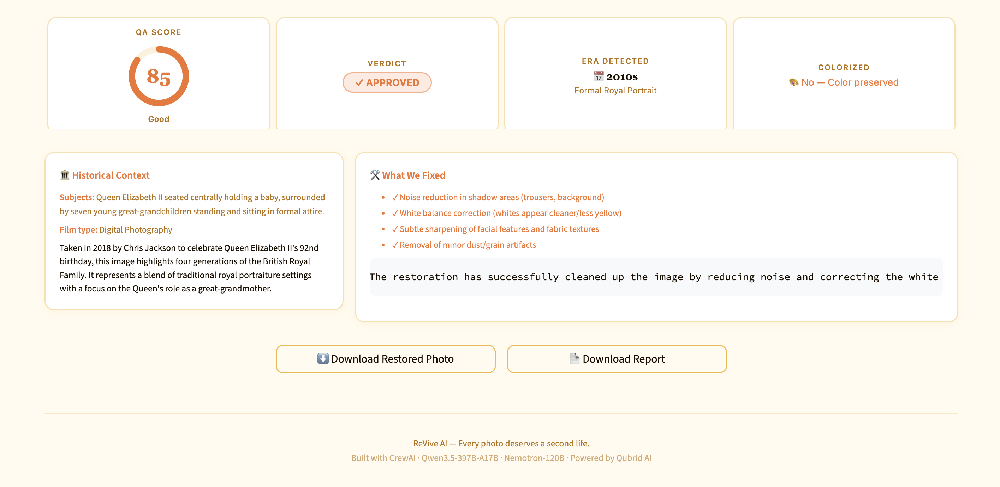
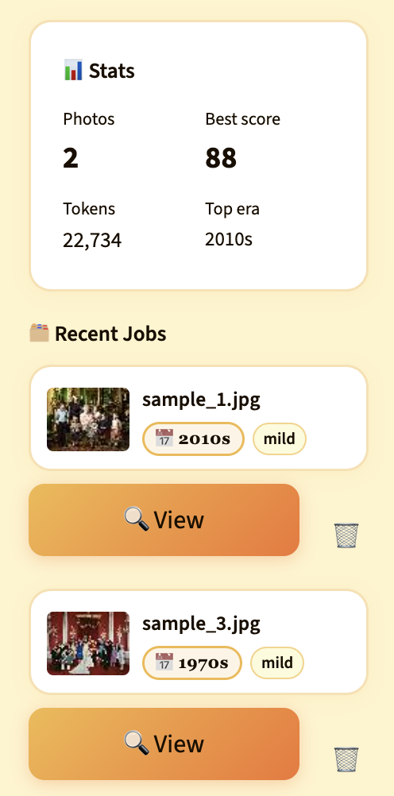

<div align="center">


# ReVive AI ✨

### From Faded to Vivid — AI-Powered Photo Restoration

[](https://python.org)
[](https://streamlit.io)
[](https://crewai.com)
[](https://qubrid.com)

> Restore old, damaged, and black-and-white photographs using a **6-agent AI crew** — each agent specialised, each step intentional.

</div>

---

## What It Does

ReVive AI takes a faded, scratched, or black-and-white photograph and runs it through a fully automated multi-agent pipeline that:

- **Reads the history** — detects era, subject matter, and colorization hints
- **Maps the damage** — identifies every scratch, fade, stain, and artifact
- **Plans the fix** — writes a precise restoration brief tailored to the photo
- **Executes the repair** — applies PIL + OpenCV operations guided by AI
- **Adds color** — historically accurate colorization for B&W photos
- **Checks the result** — scores quality 0–100, retries automatically if needed

All powered by frontier models served through **[Qubrid AI](https://qubrid.com)**.

---

## Features

### Core Capabilities
- 🖼️ **Before / After slider** — drag to compare original vs. restored side-by-side
- 🎨 **Smart colorization** — era-aware color applied only to genuine B&W photos
- 📊 **Damage report** — structured breakdown of damage type, severity, and fixes applied
- 💾 **Job history** — every restoration saved to SQLite; click any past job to replay full results
- ⬇️ **One-click download** — export restored image in original resolution
- 🧪 **Demo samples** — three synthetic test photos included (portrait, landscape, document)

### Agentic Intelligence
- 🏛️ **Photo Historian** — vision model detects decade, region, and subject context
- 🔍 **Damage Analyst** — maps every artifact type with location and severity
- 📋 **Restoration Strategist** — produces a step-by-step PIL/OpenCV repair brief
- 🛠️ **Image Restorer** — executes the brief using 10+ image processing operations
- 🎨 **Colorization Specialist** — generates historically grounded color palette instructions
- ✅ **QA Inspector** — scores output and triggers automatic retry if score < 60

---

## Screenshots

### Upload & Restore
<!-- Replace with actual screenshot -->


---

### Restoration in Progress — Live Agent Panel
<!-- Replace with actual screenshot -->


---

### Before / After Comparison Slider
<!-- Replace with actual screenshot -->


---

### Damage Report & Historical Context
<!-- Replace with actual screenshot -->


---

### Job History Sidebar
<!-- Replace with actual screenshot -->


---

## How the Pipeline Works

```
Upload Photo
     │
     ▼
┌────────────────┐
│ Photo Historian│  ← Qwen3.5-397B-A17B (vision)
│  era · context │     Reads base64 image, returns decade + colorization hints
└───────┬────────┘
        │
        ▼
┌────────────────┐
│ Damage Analyst │  ← Qwen3.5-397B-A17B (vision)
│  map · score   │    Returns structured damage_report JSON
└───────┬────────┘
        │
        ▼
┌──────────────────────┐
│ Restoration Strategist│  ← Nemotron-3-Super-120B (reasoning)
│  writes brief         │     Outputs ordered list of PIL/OpenCV steps
└───────┬──────────────┘
        │
        ▼
┌────────────────┐
│ Image Restorer │  ← Deterministic PIL + OpenCV
│  execute ops   │    Applies bilateral filter, CLAHE, clarity, enhance…
└───────┬────────┘
        │
        ▼
┌──────────────────────┐
│ Colorization Specialist│  ← Nemotron-3-Super-120B (reasoning)
│  B&W → color palette  │     Skipped for colour photos
└───────┬──────────────┘
        │
        ▼
┌──────────────┐
│ QA Inspector │  ← Qwen3.5-397B-A17B (vision)
│  score 0–100 │     Retry loop if score < 60 (up to 2 retries)
└───────┬──────┘
        │
        ▼
  Restored Image + Report
```

---

## Agent Reference

| # | Agent | Model | Role |
|---|-------|-------|------|
| 1 | 🏛️ Photo Historian | Qwen3.5-397B-A17B | Era detection, subject context, colorization hints |
| 2 | 🔍 Damage Analyst | Qwen3.5-397B-A17B | Damage mapping — type, location, severity |
| 3 | 📋 Restoration Strategist | Nemotron-3-Super-120B-A12B | Writes ordered PIL/OpenCV restoration brief |
| 4 | 🛠️ Image Restorer | PIL + OpenCV | Executes the brief deterministically |
| 5 | 🎨 Colorization Specialist | Nemotron-3-Super-120B-A12B | Historically accurate B&W colorization |
| 6 | ✅ QA Inspector | Qwen3.5-397B-A17B | Scores result 0–100, triggers retry if needed |

---

## What Makes This Different

| Feature | ReVive AI | Generic Filter App |
|---------|-----------|-------------------|
| Damage-aware restoration | ✅ Agents see and classify damage first | ❌ One-size-fits-all filter |
| Era-accurate colorization | ✅ Historian provides decade + region context | ❌ No context |
| Automatic retry | ✅ QA Inspector retries if score < 60 | ❌ No quality gate |
| Structured audit trail | ✅ Every agent logs tokens, latency, output | ❌ Black box |
| Persistent history | ✅ SQLite — replay any past job | ❌ Session-only |
| Frontier models | ✅ Qubrid AI — Qwen + Nemotron | ❌ Local / open weights only |

---

## Tech Stack

| Layer | Technology |
|-------|-----------|
| UI | Streamlit 1.x — sepia-to-vivid custom theme |
| Agent orchestration | CrewAI (sequential pipeline) |
| Vision model | **Qwen3.5-397B-A17B** via [Qubrid AI](https://qubrid.com) |
| Reasoning model | **NVIDIA Nemotron-3-Super-120B-A12B** via [Qubrid AI](https://qubrid.com) |
| Image processing | Pillow + OpenCV (bilateral filter, CLAHE, wide-Gaussian clarity) |
| Persistence | SQLite (jobs + agent logs + result JSON) |
| Package management | uv |

---

## Project Structure

```
revive-ai/
├── app.py                      # Streamlit entry point — state machine, routing
├── crew/
│   ├── agents.py               # 6 CrewAI agent definitions
│   ├── tasks.py                # Task prompts and expected outputs
│   ├── tools.py                # PIL/OpenCV CrewAI tool wrappers
│   └── pipeline.py             # Sequential pipeline + progress callbacks
├── backend/
│   ├── qwen_client.py          # Qwen3.5-397B-A17B vision API client
│   ├── nemotron_client.py      # Nemotron-120B reasoning API client
│   └── image_processor.py      # All image ops (denoise, CLAHE, clarity, enhance…)
├── database/
│   └── db.py                   # SQLite schema, migrations, CRUD helpers
├── frontend/
│   ├── components.py           # All UI render functions (slider, history, results…)
│   ├── styles.py               # Sepia-to-vivid CSS theme + sidebar overrides
│   └── assets/                 # Logo, favicon
├── config/
│   └── settings.py             # Model names, paths, prompt constants
└── assets/samples/             # 3 synthetic demo photos + generator script
```

---

## Quick Start

```bash
# 1. Clone the repo
git clone https://github.com/aryadoshii/revive-ai.git
cd revive-ai

# 2. Create virtual environment (requires uv)
uv venv
source .venv/bin/activate      # Windows: .venv\Scripts\activate

# 3. Install dependencies
uv sync

# 4. Add your API key
cp .env.example .env
# Open .env and set:  QUBRID_API_KEY=your_key_here

# 5. Run
streamlit run app.py
```

Get your free API key at **[qubrid.com](https://qubrid.com)**.

---

## Environment Variables

| Variable | Description |
|----------|-------------|
| `QUBRID_API_KEY` | API key from [qubrid.com](https://qubrid.com) — required for all agents |

---

<div align="center">

Made with ❤️ by **[Qubrid AI](https://qubrid.com)**

</div>
